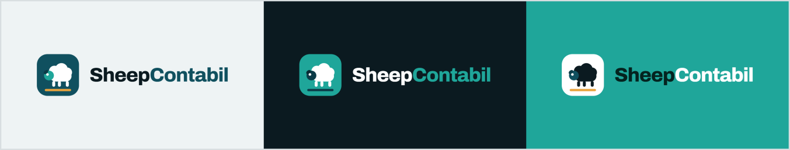

<p align="center">
  
</p>

# Portal de Automações — SheepContabil

Portal único que reúne as automações escolhidas para o desafio técnico da Sheep
Technology. Login e senha, dois perfis, um módulo por automação, histórico de
execução e saída visível — tudo hospedado na nuvem, com URL pública.

> O caso é fictício: a SheepContabil não existe e **nenhum dado aqui é real**.
> Nenhum acesso a sistema, base ou portal de órgão foi concedido: toda fronteira
> externa é mockada e toda massa de dados é sintética, gerada pelo seed.

**URL pública:** _a publicar_ · **Credenciais de demonstração:** _a publicar_

---

## Automações entregues

Quatro processos do catálogo, cobrindo **as três naturezas** (o mínimo exigido
eram duas):

| Código | Automação | Natureza | Dor medida | Status |
|--------|-----------|----------|-----------|--------|
| SC-01 | Conversão de extrato bancário para OFX | Agente de IA | 110 h/mês | a fazer |
| SC-02 | Painel de situação fiscal dos clientes | RPA | 54 h/mês | a fazer |
| SC-05 | Bloqueio e desbloqueio de clientes inadimplentes | RPA | 11 h/mês | a fazer |
| SC-20 | Vencimento de certificado digital | Controle sistematizado | 2 h/mês | a fazer |

A escolha, o raciocínio por trás dela e as armadilhas de cada processo estão em
[CLAUDE.md](CLAUDE.md), que é o contrato deste projeto. O projeto detalhado de cada
automação — especificação, decisões e **o passo a passo para testar** — está em
[SDD/](SDD/), um diretório por módulo.

## Stack

| Camada | Escolha |
|--------|---------|
| Linguagem | TypeScript (Node 22) |
| Framework | Next.js 16 (App Router) |
| Banco | PostgreSQL + Prisma 7 (driver adapter `pg`) |
| UI | Tailwind CSS 4, com os tokens da marca em `src/app/globals.css` |
| Tipografia | Archivo, IBM Plex Sans e IBM Plex Mono (`next/font`) |
| Autenticação | Auth.js — credentials + sessão, perfis `admin` e `operador` |
| Agendamento | Fila no Postgres + tick chamado por cron externo |
| IA | `@anthropic-ai/sdk` (`claude-opus-5`) — apenas no SC-01 |
| Hospedagem | Vercel (portal) + Supabase (Postgres gerenciado) |

O detalhamento por módulo — inclusive o que é determinístico e o que é IA — está
na seção 8 do [CLAUDE.md](CLAUDE.md).

## Como subir o projeto

Pré-requisitos: **Node 22+** e um **PostgreSQL**. O jeito mais curto é o Docker
do próprio repositório; se você não usa Docker, veja a alternativa abaixo.

```bash
git clone <url-do-repositorio>
cd RPA-AI

cp .env.example .env        # ajuste AUTH_SECRET (openssl rand -base64 32)
npm install
npm run db:up               # sobe o Postgres do docker-compose.yml
npm run db:migrate          # aplica as migrations
npm run db:seed             # popula com massa sintética
npm run dev                 # http://localhost:3000
```

Ou, em um comando só, depois de criar o `.env`:

```bash
npm run setup && npm run dev
```

O Postgres do compose escuta na porta **5433** do host, para conviver com outro
Postgres eventualmente já rodando na 5432.

**Sem Docker:** aponte `DATABASE_URL` no `.env` para qualquer Postgres 15+ (um
banco gratuito do [Supabase](https://supabase.com) ou do [Neon](https://neon.tech)
serve) e rode a partir do `npm run db:migrate`.

**Em produção**, o portal usa o transaction pooler do Supabase e vive num schema
próprio (`?schema=sheep`), porque o banco é compartilhado com outra aplicação. As
migrations passam pelo session pooler, via `DIRECT_URL`: o pooler de transações não
aceita DDL.

**Docker no WSL, Node no Windows:** funciona, desde que o WSL esteja em rede
espelhada. Crie `%USERPROFILE%\.wslconfig` com o conteúdo abaixo e rode
`wsl --shutdown` uma vez — sem `vmIdleTimeout`, a VM do WSL encerra quando
ociosa e derruba o banco no meio do trabalho.

```ini
[wsl2]
networkingMode=mirrored
vmIdleTimeout=-1
```

### Scripts

| Comando | O que faz |
|---------|-----------|
| `npm run dev` | Sobe o portal em desenvolvimento |
| `npm run build` / `npm start` | Build de produção e execução |
| `npm run typecheck` | `tsc --noEmit` |
| `npm run lint` | ESLint |
| `npm run db:up` / `db:down` | Sobe e derruba o Postgres local |
| `npm run db:migrate` | Cria e aplica migration em desenvolvimento |
| `npm run db:deploy` | Aplica migrations em produção |
| `npm run db:seed` | Popula o banco com massa sintética |
| `npm run db:reset` | Recria o banco do zero e semeia |
| `npm run db:studio` | Prisma Studio |
| `npm test` | Suíte de regra de negócio (Vitest) |

## Agendamento

As automações rodam sob demanda **e** sozinhas. O relógio mora fora da aplicação:
[`.github/workflows/agendador.yml`](.github/workflows/agendador.yml) chama
`POST /api/scheduler/tick` a cada 15 minutos, e o portal decide o que venceu.

A escolha é deliberada: numa hospedagem serverless não há processo em segundo plano
para manter, e o plano gratuito da Vercel limita o cron próprio a uma execução por dia —
insuficiente para o que o catálogo pede. Como efeito colateral, o agendamento fica
visível no repositório como infraestrutura.

O endpoint exige `Authorization: Bearer $SCHEDULER_TOKEN`; sem token configurado ele
fica fechado, nunca aberto. Para disparar à mão em desenvolvimento:

```bash
curl -X POST http://localhost:3000/api/scheduler/tick   -H "Authorization: Bearer $SCHEDULER_TOKEN"
```

Para conferir a agenda como está no banco, em UTC e no fuso da operação:

```bash
npx tsx scripts/verificar-agenda.ts
```

Em produção, configure os segredos `PORTAL_URL` e `SCHEDULER_TOKEN` no repositório
(Settings → Secrets → Actions).

## Configuração de ambiente

Todas as variáveis estão documentadas em [`.env.example`](.env.example) — esse
arquivo é a referência do ambiente e **toda variável nova entra nele**. O `.env`
não é versionado, e nenhum segredo aparece no histórico deste repositório.

O portal roda sem `ANTHROPIC_API_KEY`: sem a chave, o SC-01 usa apenas os
parsers determinísticos e manda para a fila de conferência o que não conseguir
ler com confiança.

## Estrutura

```
.
├── CLAUDE.md              # contrato do projeto: regras de entrega, escopo, decisões
├── SDD/                   # projeto de cada automação
│   └── SC-XX/
│       ├── SDD.md         # especificação, decisões e como testar
│       └── CLAUDE.md      # o contrato que vale dentro daquele módulo
├── docs/
│   ├── brand/             # logo da SheepContabil (seção 06 do enunciado)
│   ├── SUPOSICOES.md      # o que foi assumido onde faltou contexto, e por quê
│   └── USO-DE-IA.md       # declaração de uso de IA, exigida pelo enunciado
├── .github/workflows/     # CI e o cron externo do agendador
├── prisma/
│   ├── schema.prisma      # modelo de dados
│   └── seed.ts            # massa sintética determinística
├── scripts/               # utilitários de diagnóstico
├── prisma.config.ts       # configuração do Prisma CLI (Prisma 7)
├── docker-compose.yml     # Postgres local
└── src/
    ├── app/               # rotas do portal (um módulo por automação)
    ├── lib/               # cliente do banco e infraestrutura compartilhada
    └── generated/prisma/  # Prisma Client gerado (não versionado)
```

## Onde entraria o real

Nenhuma fronteira externa é chamada de verdade. Cada uma é uma interface com
implementação falsa e o lugar óbvio para a verdadeira — os pontos exatos estão
listados na seção 8 do [CLAUDE.md](CLAUDE.md) e são apontados na apresentação.

## Licença

[MIT](LICENSE).
